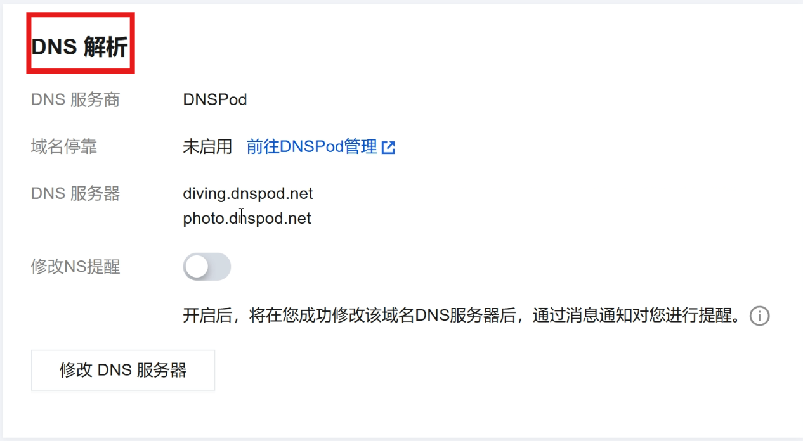
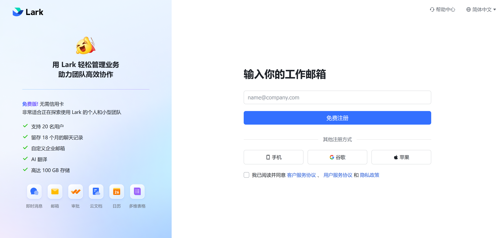
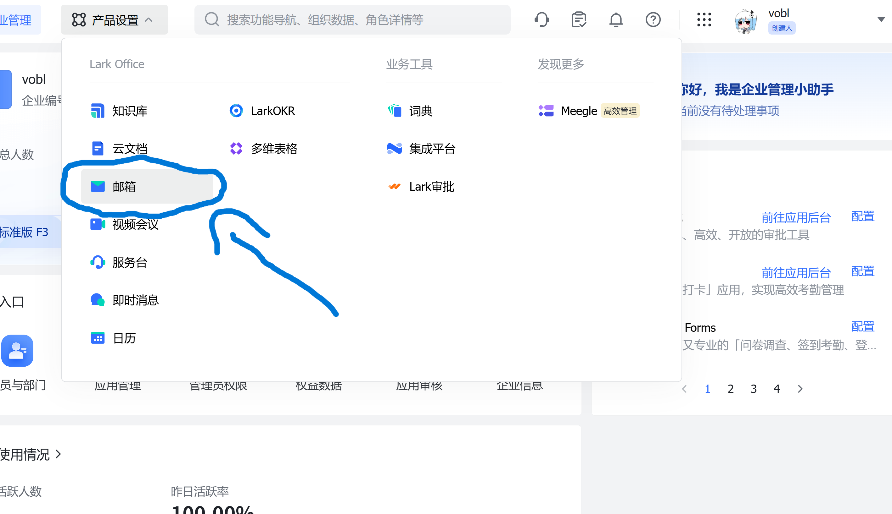

## 需要用到
一台能上网的电脑
一个域名
一台能上网的邮箱
## 前言
这个方法在2026/2/16/我写文章的时候可行的方法
## 1.进入你买域名的网站
进入腾讯云/阿里云/GoDaddy等这种域名网站（进入你买域名的地方），然后选择你自己的域名，选择名称服务器

## 2.进入cloudflare
首先，我们进入[cloudflare控制台](https://dash.cloudflare.com "点击前往cloudflare")
然后点击右上角的sign up

Email填自己的邮箱
Password填密码
之后点击下面的人机验证，再点一下sign up就行了。
## 3.绑入域名
在首页点击添加域
输入你的域名
之后会给你两个名称服务器
进入买域名的地方，再点击修改dns服务器，将两个服务器加入进去。
点确定
这时回到cloudflare，点击检查域名服务器。
等待一会就加进来了。
## 4.进入Lark
[Lark国际版](https://larksuite.com/)
点击右上角登录，然后点击注册。

输入你自己的邮箱，点击注册
注册完以后，把信息都填上，就有一个企业了.
之后，用浏览器进入[管理员页面](https://larksuite.com/admin/)
在产品设置里选择邮箱

## 5.设置邮箱
点击添加域名
在cloudflare的域名里选择dns
把lark给的dns记录全部添加进去
点击立即验证
等全部显示绿色就好了

点击完成
点击分配邮箱
再给自己分配一个自己喜欢的邮箱就行了。
## 6.常见问题
### 我进不去cloudflare怎么办！
用vpn，或者等一会
### 我没有邮箱！
用outlook，QQ邮箱，网易邮箱都行。
### 我没有域名！
买一个去
## 感谢您的观看
—— vobl 2026/2/16 12:25
---

